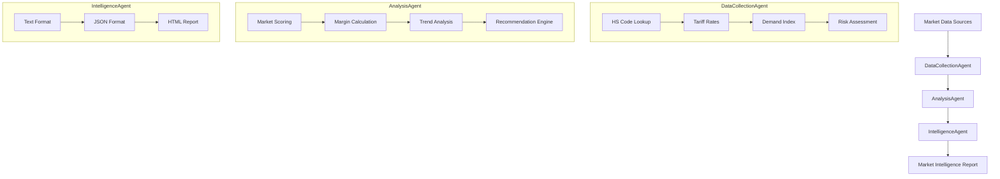

# TradeScope


*International Trade Data Analysis & Market Intelligence Toolkit*

TradeScope is a Python toolkit for cross-border business analysis, featuring AI-powered market intelligence, tariff tracking, and competitive analysis through a three-layer agent architecture.

## Architecture



## Features

- **Market Analysis** - Analyze import/export trends by HS code and country
- **Tariff Intelligence** - Track and compare tariff rates across markets
- **Demand Forecasting** - AI-powered demand prediction for product categories
- **Competitive Landscape** - Identify market dynamics and competition levels
- **Risk Assessment** - Evaluate geopolitical and trade policy risks
- **Multi-Format Output** - Generate text, JSON, or HTML reports

## Platform Support

| Platform | Status | Python Version |
|----------|--------|----------------|
| Windows | Fully Supported | 3.8, 3.9, 3.10, 3.11, 3.12 |
| macOS | Fully Supported | 3.8, 3.9, 3.10, 3.11, 3.12 |
| Linux | Fully Supported | 3.8, 3.9, 3.10, 3.11, 3.12 |
| Docker | Fully Supported | All Python versions |

## Quick Start

### Installation

```bash
# Clone the repository
git clone https://github.com/mrningzeoutlook-pixel/tradescope.git
cd tradescope

# Create virtual environment (recommended)
python -m venv venv
source venv/bin/activate  # On Windows: venv\Scripts\activate

# Install dependencies
pip install -r requirements.txt
```

### Basic Usage

```bash
# Analyze a specific market
python tradescope.py analyze --product "women-apparel" --market "EU"

# Compare across all markets
python tradescope.py compare --product "electronics"

# Generate JSON output
python tradescope.py analyze --product "home-textiles" --market "US" --output json

# Generate HTML report
python tradescope.py analyze --product "plus-size-fashion" --market "SE-Asia" --output html

# List available options
python tradescope.py list --type markets
python tradescope.py list --type products
```

### Python API Usage

```python
from src.pipeline import TradeScopePipeline

# Initialize the pipeline
pipeline = TradeScopePipeline()

# Analyze a specific market
report = pipeline.analyze(
    product="women-apparel",
    market="EU",
    output="text"
)
print(report)

# Compare across multiple markets
result = pipeline.compare_markets(
    product="electronics",
    markets=["EU", "US", "SE-Asia"]
)

# Access rankings
for ranking in result["comparison"]["rankings"]:
    print(f"#{ranking['rank']}: {ranking['market']} - Score: {ranking['score']}")
```

### Advanced API Usage

```python
from src.agents import DataCollectionAgent, AnalysisAgent, IntelligenceAgent

# Use agents individually
collection_agent = DataCollectionAgent()
analysis_agent = AnalysisAgent()
intelligence_agent = IntelligenceAgent()

# Step 1: Collect data
data = collection_agent.collect("electronics", "US")

# Step 2: Analyze with custom weights
analysis_agent.weights = {
    "tariff": 0.4,   # Prioritize low tariff
    "demand": 0.3,
    "risk": 0.3,
}
analysis = analysis_agent.analyze(data)

# Step 3: Generate report
report = intelligence_agent.generate_report(analysis, "html")
```

## Project Structure

```
tradescope/
├── src/
│   ├── __init__.py           # Package initialization
│   ├── pipeline.py           # Main orchestration pipeline
│   ├── agents/               # Agent modules
│   │   ├── __init__.py
│   │   ├── data_collection.py    # DataCollectionAgent
│   │   ├── analysis.py           # AnalysisAgent
│   │   └── intelligence.py       # IntelligenceAgent
│   ├── config/               # Configuration
│   │   ├── __init__.py
│   │   └── market_data.py    # Market data definitions
│   └── utils/                # Utility functions
│       ├── __init__.py
│       └── formatters.py     # Formatting helpers
├── tests/                    # Test suite
│   ├── test_data_collection.py
│   ├── test_analysis.py
│   ├── test_intelligence.py
│   ├── test_pipeline.py
│   └── test_utils.py
├── docs/                     # Documentation
│   ├── CONTRIBUTING.md
│   └── CODE_OF_CONDUCT.md
├── examples/                 # Usage examples
│   └── analysis_example.py
├── .github/
│   └── workflows/
│       └── ci.yml            # CI/CD pipeline
├── .env.example              # Environment template
├── .gitignore
├── Dockerfile
├── docker-compose.yml
├── LICENSE
├── README.md
├── requirements.txt
└── setup.py
```

## Configuration

### Environment Variables

Copy `.env.example` to `.env` and configure:

```bash
# API Configuration
TRADESCOPE_API_KEY=your_api_key
TRADESCOPE_API_URL=https://api.tradescope.io/v1

# Logging
LOG_LEVEL=INFO

# Output Settings
DEFAULT_OUTPUT_FORMAT=text
```

### Market Data

Market data is configured in `src/config/market_data.py`:

```python
MARKET_DATA = {
    "EU": MarketInfo(
        country="European Union",
        region="Europe",
        tariff_rate=12.0,
        demand_index=85.0,
        competition_level="High",
        risk_score=0.3,
    ),
    # ... more markets
}
```

### Product Categories

Configure product categories with HS codes:

```python
PRODUCT_CATEGORIES = {
    "women-apparel": {
        "hs_codes": ["6204", "6206"],
        "avg_margin": 0.45,
        "description": "Women's clothing",
    },
    # ... more products
}
```

## Testing

```bash
# Run all tests
pytest tests/ -v

# Run with coverage
pytest tests/ -v --cov=src --cov-report=html

# Run specific test file
pytest tests/test_pipeline.py -v
```

## Docker

### Build Image

```bash
docker build -t tradescope .
```

### Run with Docker

```bash
# CLI mode
docker run --rm tradescope python tradescope.py analyze --product "electronics" --market "EU"

# Interactive shell
docker compose --profile shell run tradescope-shell
```

## Roadmap

- [x] Core market analysis engine
- [x] Tariff comparison tool
- [x] Multi-format report generation
- [x] Docker support
- [ ] AI-powered demand forecasting
- [ ] Real-time trade policy monitoring
- [ ] Competitive landscape dashboard
- [ ] Integration with customs databases

## Contributing

Contributions are welcome! Please see [CONTRIBUTING.md](docs/CONTRIBUTING.md) for guidelines.

## License

MIT License - see [LICENSE](LICENSE) for details.

---

Built for cross-border entrepreneurs, by a cross-border entrepreneur.
