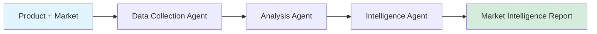

# TradeScope 📊

[](https://www.python.org/downloads/)
[](LICENSE)
[](https://github.com/mrningzeoutlook-pixel/tradescope)

**International Trade Data Analysis & Market Intelligence Toolkit**

Analyze markets, compare tariffs, and generate actionable trade insights — built by a cross-border entrepreneur, for cross-border entrepreneurs.

## 🎯 Problem Statement

Cross-border trade decisions are often made based on incomplete information. Small and medium businesses lack access to the same market intelligence tools that large corporations use. Understanding tariff changes, demand trends, and competitive dynamics across markets requires hours of manual research.

## ✨ Solution

TradeScope provides a multi-agent AI pipeline for trade intelligence:



## 🏗️ Architecture

| Agent | Responsibility | Input | Output |
|-------|---------------|-------|--------|
| **DataCollectionAgent** | Gather trade statistics and policy data | Product + Market | Raw trade data |
| **AnalysisAgent** | Process and analyze market trends | Trade data | Market scores & recommendations |
| **IntelligenceAgent** | Generate actionable insights | Analysis results | Formatted intelligence report |

### Supported Markets

| Market | Region | Tariff Rate | Demand Index | Risk Level |
|--------|--------|-------------|-------------|------------|
| European Union | Europe | 12.0% | 85/100 | Low (0.3) |
| United States | North America | 16.5% | 92/100 | Low (0.25) |
| Southeast Asia | Asia-Pacific | 5.0% | 78/100 | Medium (0.4) |
| Middle East | MENA | 8.0% | 70/100 | Medium (0.5) |
| Latin America | Americas | 14.0% | 65/100 | Medium (0.45) |
| Japan & Korea | Asia-Pacific | 10.0% | 88/100 | Low (0.2) |

## 🚀 Quick Start

### Installation

```bash
git clone https://github.com/mrningzeoutlook-pixel/tradescope.git
cd tradescope
pip install -r requirements.txt
```

### CLI Usage

```bash
# Analyze a single market
python tradescope.py analyze --product "women-apparel" --market "EU"

# Compare across all markets
python tradescope.py compare --product "plus-size-fashion" --output json
```

### Python API

```python
from tradescope import TradeScopePipeline

pipeline = TradeScopePipeline()

# Analyze a market
report = pipeline.analyze("women-apparel", "EU", output="text")
print(report)

# Compare all markets
comparison = pipeline.compare("plus-size-fashion")
print(f"Best market: {comparison['best_market']}")
```

## 📂 Project Structure

```
tradescope/
├── src/
│   ├── agents/          # Agent implementations
│   ├── config/          # Market data configurations
│   ├── utils/           # Utility functions
│   └── pipeline.py      # Main pipeline orchestration
├── tests/               # Test suite
├── docs/                # Documentation
├── examples/            # Usage examples
├── tradescope.py        # CLI entry point
├── setup.py             # Package configuration
├── Dockerfile           # Docker support
└── README.md
```

## 🛠️ Built With

- **Python 3.11+** - Core runtime
- **AI Agents** - Multi-step data analysis and insight generation
- **Data Visualization** - Matplotlib + Plotly for market charts

## 📊 Roadmap

- [x] **v0.1** - Core market analysis engine
- [x] **v0.2** - Modular agent architecture + multi-market comparison
- [ ] **v0.3** - AI-powered demand forecasting
- [ ] **v0.4** - Real-time trade policy monitoring
- [ ] **v0.5** - Competitive landscape dashboard
- [ ] **v1.0** - Integration with customs databases

## 🧪 Testing

```bash
pytest tests/ -v
pytest --cov=src tests/
```

## 👤 Author

**Mary Ma** — [@mrningzeoutlook-pixel](https://github.com/mrningzeoutlook-pixel)

## 📝 License

MIT License

---

Built for cross-border entrepreneurs, by a cross-border entrepreneur.
